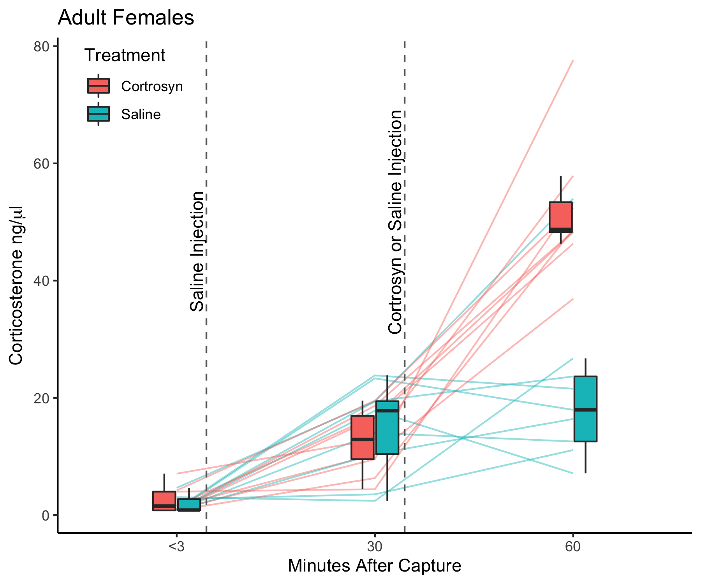
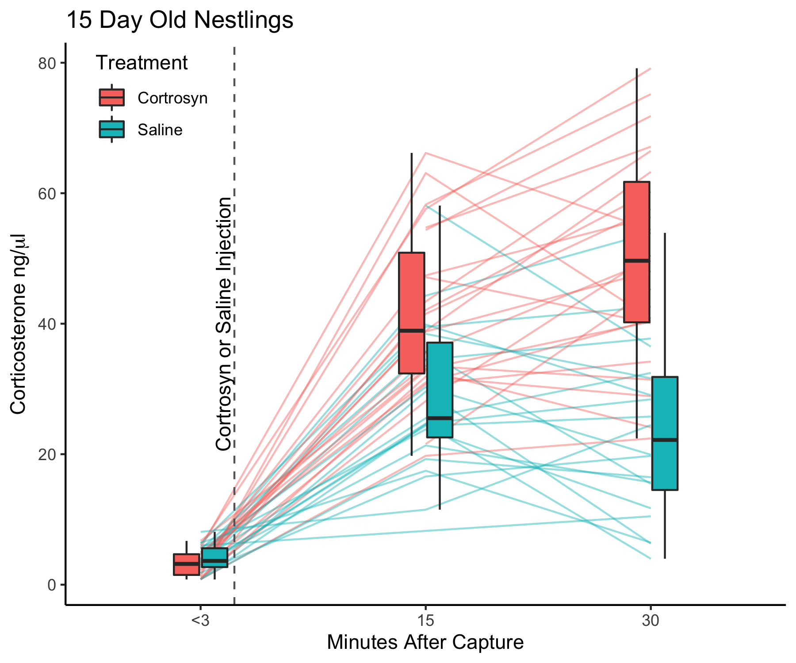
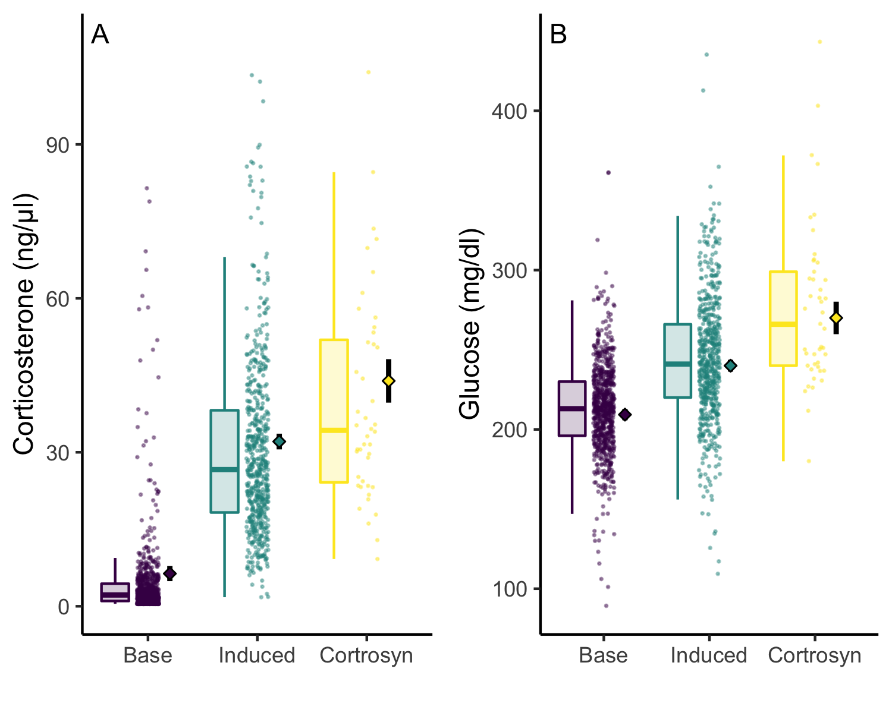
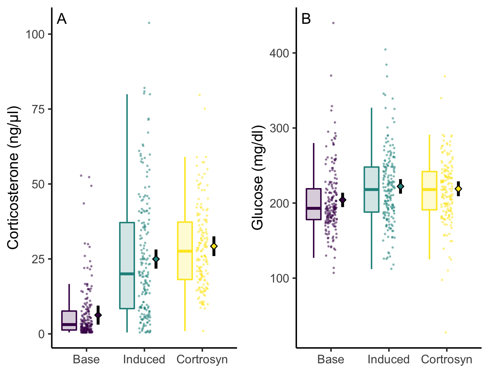
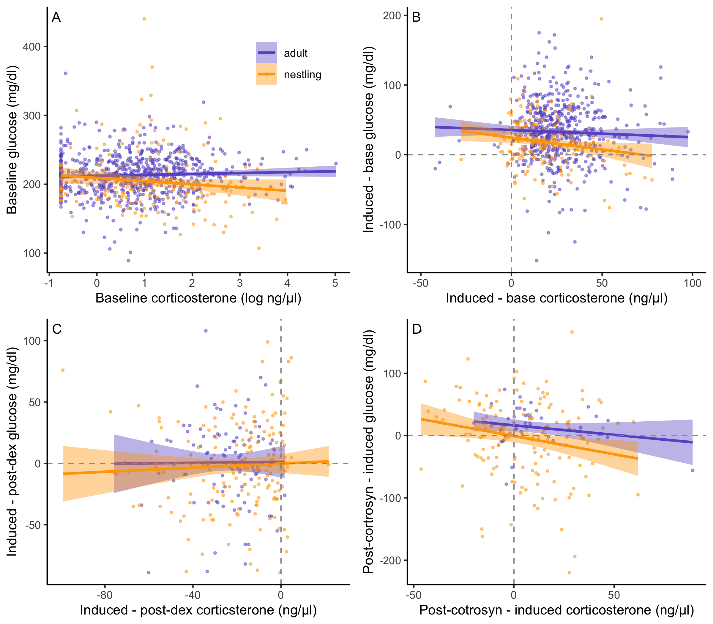
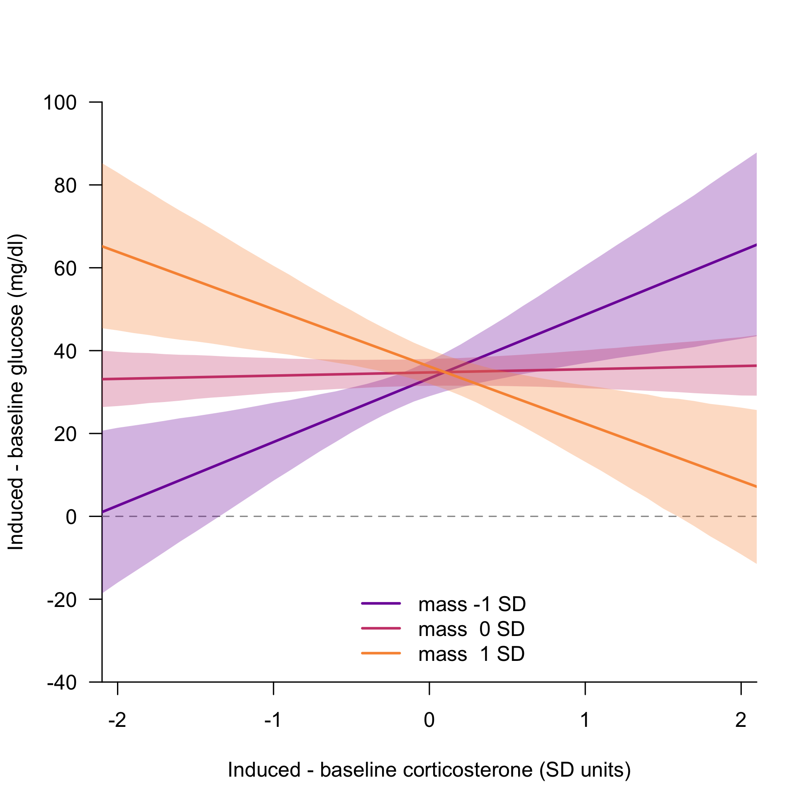
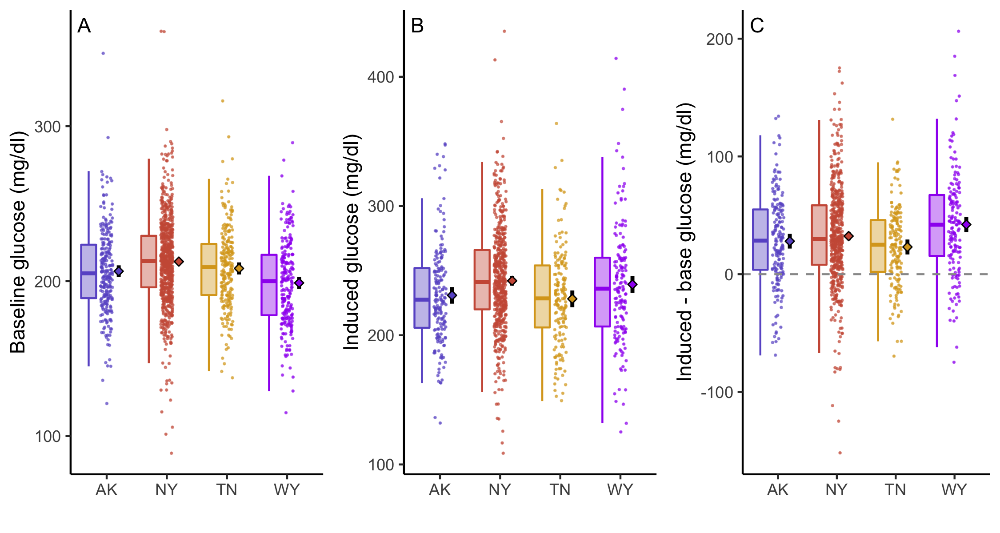
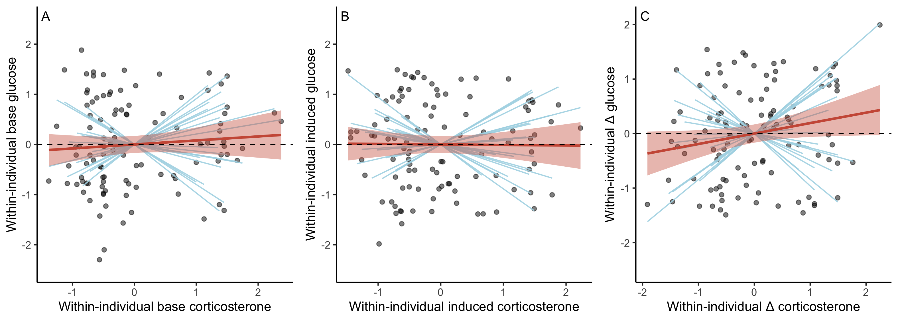

```{r setup, include=FALSE}
knitr::opts_chunk$set(echo = TRUE)
library(knitr)
library(dplyr)
library(ggplot2)
library(here)
library(sjPlot)
```

# Cortrosyn Validation

These are the figures and table for the supplementary materials demonstrating that Cortrosyn worked.  

\

\

```{r echo = FALSE}

t1 <- readRDS(here::here("2_r_scripts/acth_table.rds"))
t1

```

# Basic comparison of cort and glucose by sample time

\

\

```{r echo = FALSE}
t1 <- readRDS(here::here("2_r_scripts/ny_ad_nestling_basic_model.rds"))
t1
```

# Between individual covariance

\

```{r echo = FALSE}
ta <- readRDS(here::here("2_r_scripts/adult_covariation.rds"))
tn <- readRDS(here::here("2_r_scripts/nestling_covariation.rds"))
ta
tn
```

\

# Population comparison

\

```{r echo = FALSE}
tc1 <- readRDS(here::here("2_r_scripts/pop_base_glucose.rds"))
tc2 <- readRDS(here::here("2_r_scripts/pop_change_glucose.rds"))
tc1
tc2
```

# Within individual
\